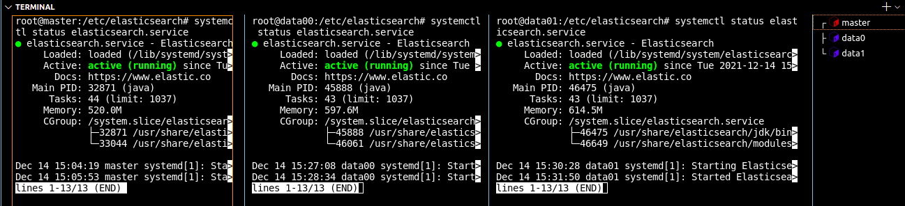
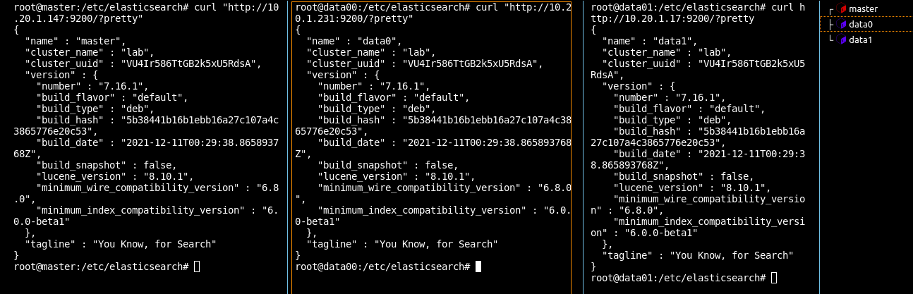

# Creatng an Elasticsearch Cluster

The goal of this lab is to create an elasticsearch cluster of 3 nodes locally on 3 ubuntu 20.04 server VMs.


## Preparing the environment

We create the first VM and install Elasticsearch and Logstash on it using the following commands: 

```
sudo wget -qO - https://artifacts.elastic.co/GPG-KEY-elasticsearch | sudo apt-key add -
sudo apt-get install apt-transport-https
echo "deb https://artifacts.elastic.co/packages/7.x/apt stable main" | sudo tee -a /etc/apt/sources.list.d/elastic-7.x.list
sudo apt-get update && sudo apt-get install elasticsearch && sudo apt-get install logstash
```

Modify the `/etc/hosts` file to define the hostnames of the nodes in your cluster : 
```
10.5.9.22 master
10.5.8.168 data00
10.5.10.204 data01
```


Now, clone 2 other VMs. Make sure to generate new MAC@s and IP@s. (If everything is working good make sure to create snapshots)


In each VM change the hostname using : `sudo hostnamectl set-hostname <new-hostname>` and `reboot`
 
Configure static IP@s for the VMs using netplan. Cd to `/etc/netplan` and configure the conf file. 

```
network:
  version : 2
  renderer : networkd
  ethernets :
    ens33 : 
      dhcp4 : false
      addresses : [10.5.9.22/16]
      gateway4 : 10.5.0.2
      nameservers : 
        addresses :[8.8.8.8, 8.8.4.4] #Use ( nmcli dev list || nmcli dev show ) 2>/dev/null | grep DNS, to get your dns@s if public DNS is not an option.
```

## Configuring Elasticsearch

cd to `/etc/elasticsearch` in each VM, we'll configure the elasticsearch cluster with the `elasticsearch.yml` file : 

Master Node :  
```yml
cluster.name: lab

node.name: "master"

node.master: true

node.data: true

network.host: 10.5.9.22

http.port: 9200

discovery.seed_hosts: ["10.5.9.22", "10.5.8.168","10.5.10.204"]

cluster.initial_master_nodes: ["10.5.9.22"]
```
Data0 Node :
```yml
cluster.name: lab

node.name: "data00"

node.data: true

network.host: 10.5.8.168

http.port: 9200

discovery.seed_hosts: ["10.5.9.22", "10.5.8.168","10.5.10.204"]

cluster.initial_master_nodes: ["10.5.9.22"]
```
Data1 Node :
```yml
cluster.name: lab

node.name: "data01"

node.data: true

network.host: 10.5.10.204

http.port: 9200

discovery.seed_hosts: ["10.5.9.22", "10.5.8.168","10.5.10.204"]

cluster.initial_master_nodes: ["10.5.9.22"]
```


Start elasticsearch on every node using : 
```bash
sudo systemctl daemon-reload
sudo systemctl enable elasticsearch # To start auto elasticsearch on boot 
sudo systemctl start elasticsearch
```

If the cluster was configured correctly, the cluster should be up and running, to verify we use : 
```bash 
sudo systemctl status elasticsearch
```


You can also use the `curl` command to check on the cluster :




